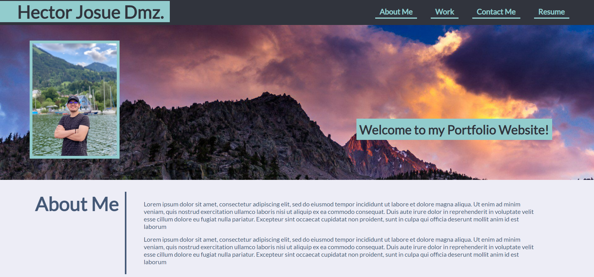

# Code Refactor Starter Code

## Description

This is the second week challenge in the Bootcamp, I needed create a portfolio page from scratch but following the design provided at the bootcamp, I used what I learned of HTML and CSS from the course and also reading documentation from internet to achive the final product.

Click [HERE](https://hectorhjdh.github.io/My-personal-Portfolio/) to see the deployed application.

## Usage

Interactive basic web application, you can click the images for you to get to another example html or click the nav titles link for going to that section.

## NEW

Now you can visit Project 1 - HOUSE FINDER in the Work section!
